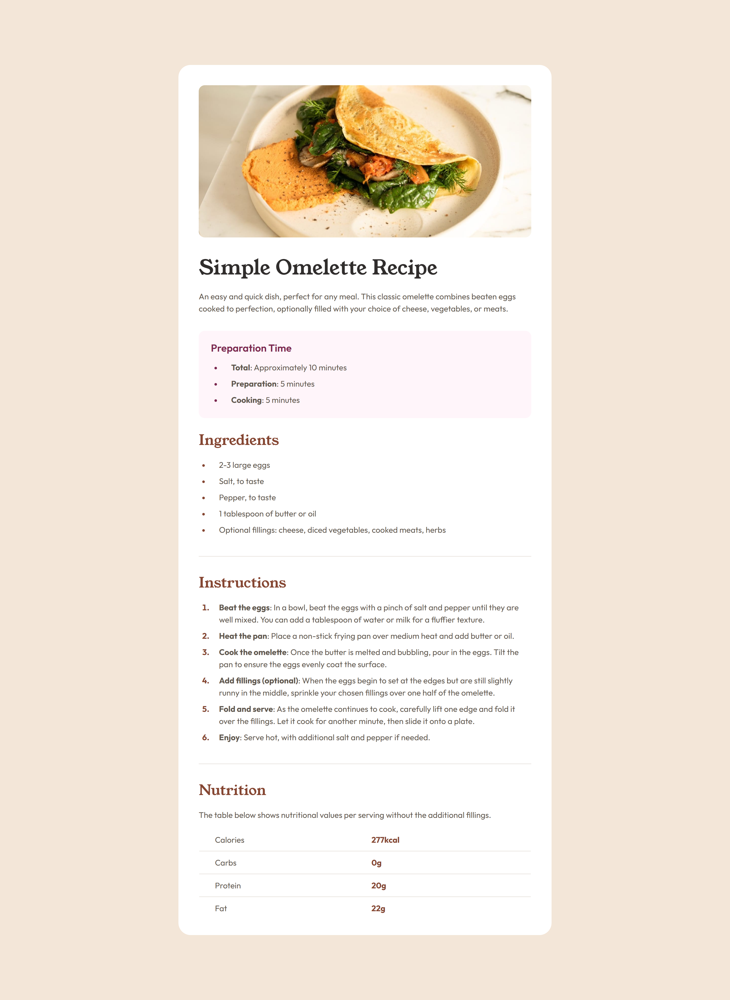

# Frontend Mentor - Recipe page solution

This is a solution to the [Recipe page challenge on Frontend Mentor](https://www.frontendmentor.io/challenges/recipe-page-KiTsR8QQKm). Frontend Mentor challenges help you improve your coding skills by building realistic projects.

## Table of contents

- [Overview](#overview)
  - [The challenge](#the-challenge)
  - [Screenshot](#screenshot)
  - [Links](#links)
- [My process](#my-process)
  - [Built with](#built-with)
  - [What I Learned](#what-i-learned)
- [Author](#author)

## Overview

### Screenshot

### Links

- Solution URL: [https://github.com/Arsalan2078/recipe-page/tree/part-2](https://github.com/Arsalan2078/recipe-page/tree/part-2)
- Live Site URL: [https://arsalan2078.github.io/recipe-page/](https://arsalan2078.github.io/recipe-page/)

## My process

### Built with

- Semantic HTML5 markup
- CSS custom properties
- Tailwind
- Flexbox
- Mobile-first workflow
- Vite React

### What I Learned

This is my first frontent-mentor challenge completed using Tailwind CSS. Getting familiar with it. Combined usage of utility classes with react components for cleaner code.

## Author

- Frontend Mentor - [@Arsalan2078](https://www.frontendmentor.io/profile/Arsalan2078)
